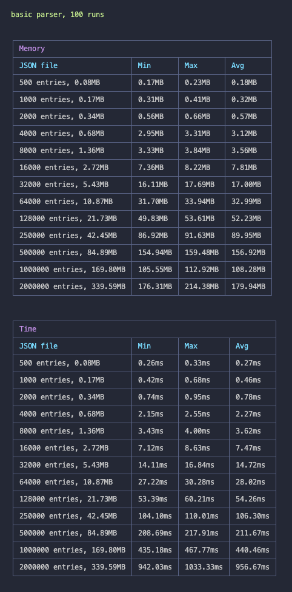
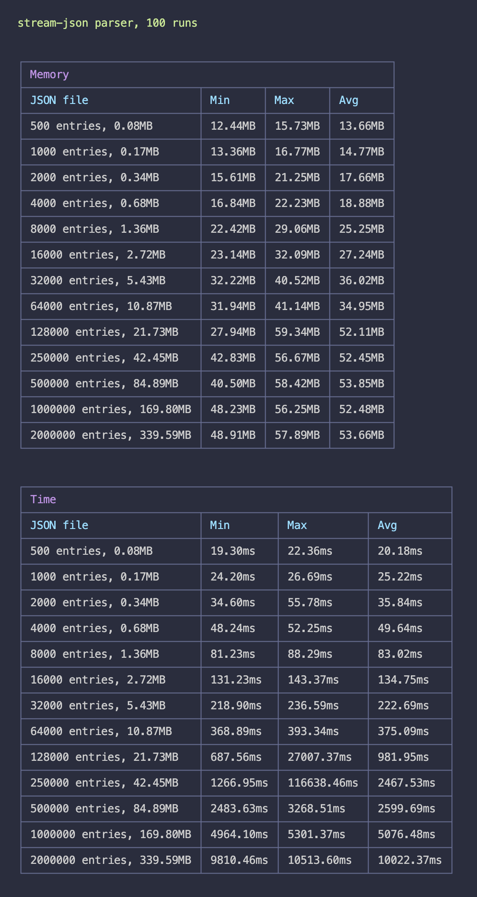

# JSON parsing benchmark

A simple benchmark targeting a real-case scenario of a big JSON file to parse

## Parsers analyzed

- `JSON.parse`
- [stream-json](https://www.npmjs.com/package/stream-json)
- [JSONStream](https://www.npmjs.com/package/JSONStream)
- [BFJ](https://www.npmjs.com/package/bfj) (with .walk)

> Note: JSONStream and BFJ have been tested but not included in the parsers because the reference implementation was orders of magnitude slower and more memory-consuming than the first two options

## Setup

Install dependencies
```bash
yarn
```

Generate entrypoint files
```bash
yarn generate
```

Run the benchmarks ( it might take a while )
```bash
yarn bench basic
```
```bash
yarn bench stream-json
```

## Results on a MacBook Pro M1 Pro 16 GB

| basic | stream-json |
|----|----|
|  |   |